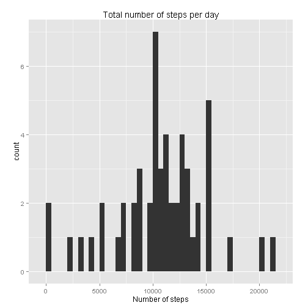
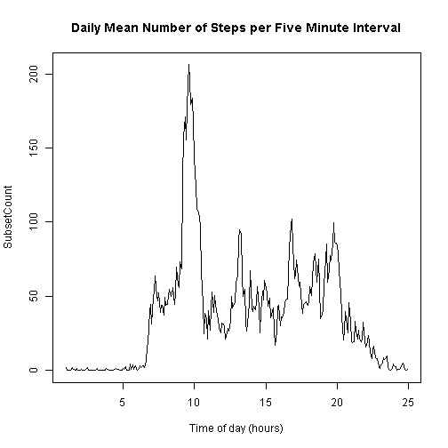
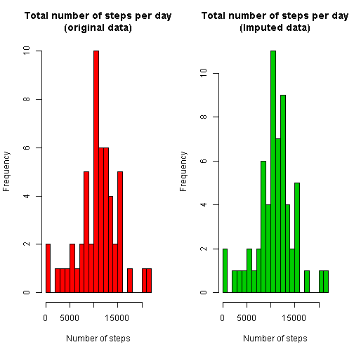
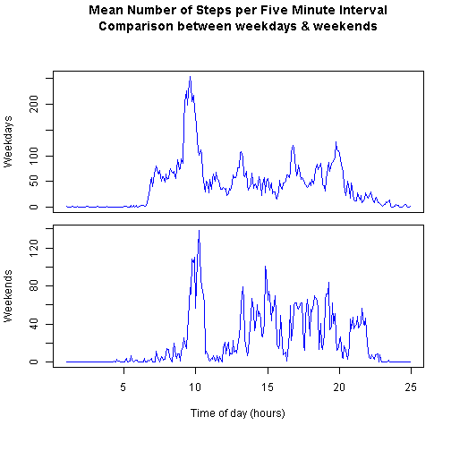

# Coursera Reproducible Research Course

# Assignment 1

In this assignment we will analyse the number of steps recorded in five
minute intervals during the period of 61 days from Monday 1st Oct 2012 to 
Friday 30th Nov 2012 by people wearing activity monitoring devices.

The dataset used is the Activity Monitoring Data : 'activity.csv' 

## Section A : Loading and Preprocessing the data

The data archive was downloaded from the course website and the file 
**activity.csv** unzipped into the project folder. 

The R code to read the file is :-


```r
Data <- read.csv("activity.csv")
str(Data)
```

```
## 'data.frame':	17568 obs. of  3 variables:
##  $ steps   : int  NA NA NA NA NA NA NA NA NA NA ...
##  $ date    : Factor w/ 61 levels "2012-10-01","2012-10-02",..: 1 1 1 1 1 1 1 1 1 1 ...
##  $ interval: int  0 5 10 15 20 25 30 35 40 45 ...
```
Examining the downloaded file (using the function *View(Data)*) 
indicates that the file has a regular structure with counts of steps 
for 288 five minute intervals in chronological order for each of the 
61 days. (61 x 288 = 17,568 rows of data).

There are three variables :

- Numbers of steps in each interval (steps : integer)
- Date (date : character string)
- Five minute interval identifier : (interval : integer of the form *hhmm*)

There are NA values in some of the 'steps' variables. A visual inspection of 
the data suggests that no counts were taken on the following days :

- Monday    2012/10/01
- Monday    2012/10/08
- Thursday  2012/11/01
- Sunday    2012/11/04
- Friday    2012/11/09
- Saturday  2012/11/10
- Wednesday 2012/11/14
- Friday    2012/11/30

In order to facilitate the analysis, some preprocessing was undertaken :

- An index variable in the range 1:288 was substituted for interval identifiers
- The weekday name and a weekday index number was added to each record
- A new data.frame was created by subsetting to remove any incomplete records (NA's)
- A day number index variable was added to the original and subset data.frames.

The subsetting operation removed all the rows relating to the eight days previously
identified, (8 x 288 = 2304 rows).

**Convert interval variableto index, add day names and index number & subset :**


```r
Data$interval <- as.integer(as.factor(Data$interval))
Data$Weekday <- as.factor(weekdays(as.Date(Data$date)))
Data$Weekdaynumber <- as.integer(Data$Weekday)

Temp <- complete.cases(Data)
Subset <- Data[Temp, ]
```
**Add date indexes & determine number of rows and number of complete days removed by subsetting**


```r
Data$daynumber <- as.integer(as.factor(as.Date(Data$date)))
Subset$daynumber <- as.integer(as.factor(as.Date(Subset$date))) 
head(Data)
```

```
##   steps       date interval Weekday Weekdaynumber daynumber
## 1    NA 2012-10-01        1  Monday             2         1
## 2    NA 2012-10-01        2  Monday             2         1
## 3    NA 2012-10-01        3  Monday             2         1
## 4    NA 2012-10-01        4  Monday             2         1
## 5    NA 2012-10-01        5  Monday             2         1
## 6    NA 2012-10-01        6  Monday             2         1
```

```r
head(Subset)
```

```
##     steps       date interval Weekday Weekdaynumber daynumber
## 289     0 2012-10-02        1 Tuesday             6         1
## 290     0 2012-10-02        2 Tuesday             6         1
## 291     0 2012-10-02        3 Tuesday             6         1
## 292     0 2012-10-02        4 Tuesday             6         1
## 293     0 2012-10-02        5 Tuesday             6         1
## 294     0 2012-10-02        6 Tuesday             6         1
```

```r
RR <- dim(Data)[1] - dim(Subset)[1]
DR <- max(Data$daynumber) - max(Subset$daynumber)
Stats <- data.frame(Legend...=c("Rows removed  :", "Days removed  :"), 
		Statistics=c(RR, DR))
Stats
```

```
##         Legend... Statistics
## 1 Rows removed  :       2304
## 2 Days removed  :          8
```

```r
View(Data)
View(Subset)
```
## Section B : Calculate and plot daily total number of steps recorded

This analysis was performed on the subset data with the NA values removed.

### 1. Calculate total number of steps for each of the 53 days in the subset : 


```r
Dailysteps <- rep(0, max(Subset$daynumber))
for(i in 1:dim(Subset)[1])
{	Dailysteps[Subset$daynumber[i]] <- Dailysteps[Subset$daynumber[i]] + Subset$steps[i]
}

## For comparison, reinsert the NA values
OriginalDailysteps <- c(NA, Dailysteps[1:6], NA, Dailysteps[7:29], NA, 
		Dailysteps[30:31], NA, Dailysteps[32:35], NA, NA, Dailysteps[36:38],
		NA, Dailysteps[39:53], NA)
```
### 2. Plot the histogram :


```r
library(ggplot2)
qplot(Dailysteps, geom="histogram", xlab="Number of steps",
	main="Total number of steps per day", binwidth=500, asp=1.0)
```

 
### 3. Mean and median of the total number of steps per day :


```r
Stats <- data.frame(Mean=round(mean(Dailysteps), 0), Median=median(Dailysteps))
Stats
```

```
##    Mean Median
## 1 10766  10765
```
## Section C : Investigate mean number of steps per five minute interval

### 1. Calculate mean number of steps in each five minute interval using subset data


```r
SubIntervalsteps <- rep(0, max(Subset$interval))
for(i in 1:dim(Subset)[1])
{	SubIntervalsteps[Subset$interval[i]] <- SubIntervalsteps[Subset$interval[i]] + Subset$steps[i]
}
SubIntervalsteps <- SubIntervalsteps / max(Subset$daynumber)
head(SubIntervalsteps)
```

```
## [1] 1.7169811 0.3396226 0.1320755 0.1509434 0.0754717 2.0943396
```
### 2. Create time series plot

The vector of means was converted to an hourly time series with frequency = 12
using function *ts()* and plotted with the generic *plot()* function.


```r
SubsetCount <- ts(SubIntervalsteps, start=1, frequency=12)
plot(SubsetCount, main="Daily Mean Number of Steps per Five Minute Interval", 
	xlab="Time of day (hours)")
```

 
### 3. Find time interval with maximum activity level


```r
Max <- max(SubIntervalsteps)
MaxInt <- 0
for(i in 1:288)

{	if(SubIntervalsteps[i] == Max) MaxInt <- i
}
Stats <- data.frame(Statistic=c("Maximum steps", "Interval number"), 
					Value=c(round(Max, 0), MaxInt))
Stats
```

```
##         Statistic Value
## 1   Maximum steps   206
## 2 Interval number   104
```
Interval 104 (8.40 am) had greatest activity with a mean of 206 steps.


## Section D : Impute missing values and compare with original analysis

The weekdays with missing data are : Monday (2), Wednesday (1), Thursday (1),
Friday (2), Saturday (1). 

The data collection started on a Monday and included 9 sets of weekdays and 
eight weekends; therefore data was collected for : 
Mondays (7), Tuesdays (9), Wednesdays (8), Thursdays (8), Fridays (7), Saturdays (7), Sundays (8).

To minimise bias we will calculate the mean number of steps per time interval
for each day of the week from the subset data and replace the NA values with 
the mean values for the relevant day.

### 1. Create matrix of mean number of steps in each five minute interval per weekday
 

```r
Temp <- matrix(0, 288, 7)
for(i in 1:dim(Subset)[1])
{	Temp[Subset$interval[i], Subset$Weekdaynumber[i]] <- Temp[Subset$interval[i], Subset$Weekdaynumber[i]] + Subset$steps[i]
}
Daycount <- c(7, 7, 7, 8, 8, 9, 8) ## days with measurements
Dayorder <- c(2, 6, 7, 5, 6, 3, 4)	## days are indexed in alphabetical order
for(i in 1:7)
{	Temp[ , i] <- round(Temp[ , i] / Daycount[i], 0)
}

## display a sample

Stats <- data.frame(Mon=Temp[100:105, Dayorder[1]],
			Tue=Temp[100:105, Dayorder[2]],
			Wed=Temp[100:105, Dayorder[3]],
			Thu=Temp[100:105, Dayorder[4]],
			Fri=Temp[100:105, Dayorder[5]],
			Sat=Temp[100:105, Dayorder[6]],
			Sun=Temp[100:105, Dayorder[7]])

Stats
```

```
##   Mon Tue Wed Thu Fri Sat Sun
## 1  15 177 216 283 177  39 104
## 2 101 170 262 232 170  29 109
## 3  30 141 266 238 141  61  60
## 4 114 163 276 186 163  92 108
## 5 226 155 273 252 155 156  88
## 6 172 178 265 264 178 144  88
```
### 2. Substitute calculated means for NA's in original data


```r
for(i in 1:dim(Data)[1])
{	if(is.na(Data$steps[i])) Data$steps[i] <- Temp[Data$interval[i] , Data$Weekdaynumber[i]]
}
View(Data)
```

### 3. Calculate total number of steps in each five minute interval


```r
ImputedDailysteps <- rep(0, max(Data$daynumber))
for(i in 1:dim(Data)[1])
{	ImputedDailysteps[Data$daynumber[i]] <- ImputedDailysteps[Data$daynumber[i]] + Data$steps[i]
}
```
**Total daily number of steps before and after imputing :**


```r
OriginalDailysteps
```

```
##  [1]    NA   126 11352 12116 13294 15420 11015    NA 12811  9900 10304
## [12] 17382 12426 15098 10139 15084 13452 10056 11829 10395  8821 13460
## [23]  8918  8355  2492  6778 10119 11458  5018  9819 15414    NA 10600
## [34] 10571    NA 10439  8334 12883  3219    NA    NA 12608 10765  7336
## [45]    NA    41  5441 14339 15110  8841  4472 12787 20427 21194 14478
## [56] 11834 11162 13646 10183  7047    NA
```

```r
ImputedDailysteps
```

```
##  [1]  9978   126 11352 12116 13294 15420 11015  9978 12811  9900 10304
## [12] 17382 12426 15098 10139 15084 13452 10056 11829 10395  8821 13460
## [23]  8918  8355  2492  6778 10119 11458  5018  9819 15414  8215 10600
## [34] 10571 10739 10439  8334 12883  3219 12360 12536 12608 10765  7336
## [45] 11783    41  5441 14339 15110  8841  4472 12787 20427 21194 14478
## [56] 11834 11162 13646 10183  7047 12360
```

### 4. Construct histograms of the original and imputed data.


```r
par(mfrow=c(1, 2))
hist(Dailysteps,  xlab="Number of steps",
	main="Total number of steps per day\n(original data)", breaks=30, col=2)
hist(ImputedDailysteps,  xlab="Number of steps",
	main="Total number of steps per day\n(Imputed data)", breaks=30, col=3)
```

 

### 5. Mean and median of the total number of steps per day :


```r
Origmean <- round(mean(Dailysteps), 0)
Impmean <- round(mean(ImputedDailysteps), 0)
Origmedian <- median(Dailysteps)
Impmedian <- median(ImpDailysteps)

Stats <- data.frame(Statistic=c("Mean    :", "Median  :"),
				Original_data=c(Origmean, Origmedian),
				Imputed_data=c(Impmean, Impmedian))
Stats
```

```
##   Statistic Original_data Imputed_data
## 1 Mean    :         10766        10796
## 2 Median  :         10765        10765
```

## Section E : Analysis of weekday / weekend difference in activity patterns

We will calculate and compare the mean number of steps in each five minute 
interval for weekdays and weekends, using the full dataset with imputed values,
and create a multivariate time series plot.

As noted above, the two month period covered by the data covers nine sets of
weekdays (9 x 5 = 45 days) and eight weekends (8 x 2 = 16 days).

**Calculate mean number of steps for weekdays and weekends**
 

```r
Weekdaysteps <- Weekendsteps <- rep(0, max(Data$interval))
for(i in 1:dim(Data)[1])
{	if(Data$Weekdaynumber[i] == 3 || Data$Weekdaynumber[1] == 4)
	{ Weekendsteps[Data$interval[i]] <- Weekendsteps[Data$interval[i]] + Data$steps[i] }
	else
	{ Weekdaysteps[Data$interval[i]] <- Weekdaysteps[Data$interval[i]] + Data$steps[i] }
}
Weekdaysteps <- Weekdaysteps / 45
Weekendsteps <- Weekendsteps / 16
```

**Convert to time series and plot**


```r
Counts2 <- ts(data.frame(Weekdays=Weekdaysteps, Weekends=Weekendsteps), start=1, frequency=12)
View(Counts2)
plot(Counts2, plot.type="m", mar=c(gap=0.5, 4.1, gap=0.5, 2.1), ylim=c(0, 250),
	main="Mean Number of Steps per Five Minute Interval\nComparison between weekdays & weekends", 
	xlab="Time of day (hours)", col=4)
```

 

The graph shows that there is generally less activity at the weekends, 
in particular, the early morning peak in activity is less pronounced and 
daytime activity seems to start and end about two hours later in the day at 
weekends. (Note different y-axis scales).


**---------------------------------------------------------------------------------------------------**


#### Created from 'CRR_Project_1.Rmd' on Thu Apr 16 2015 - 16:13:39

